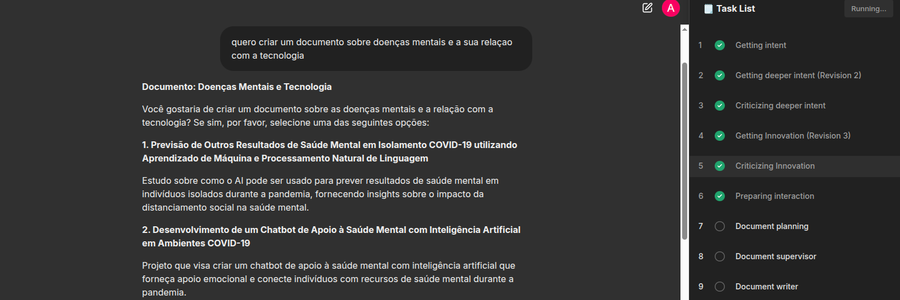
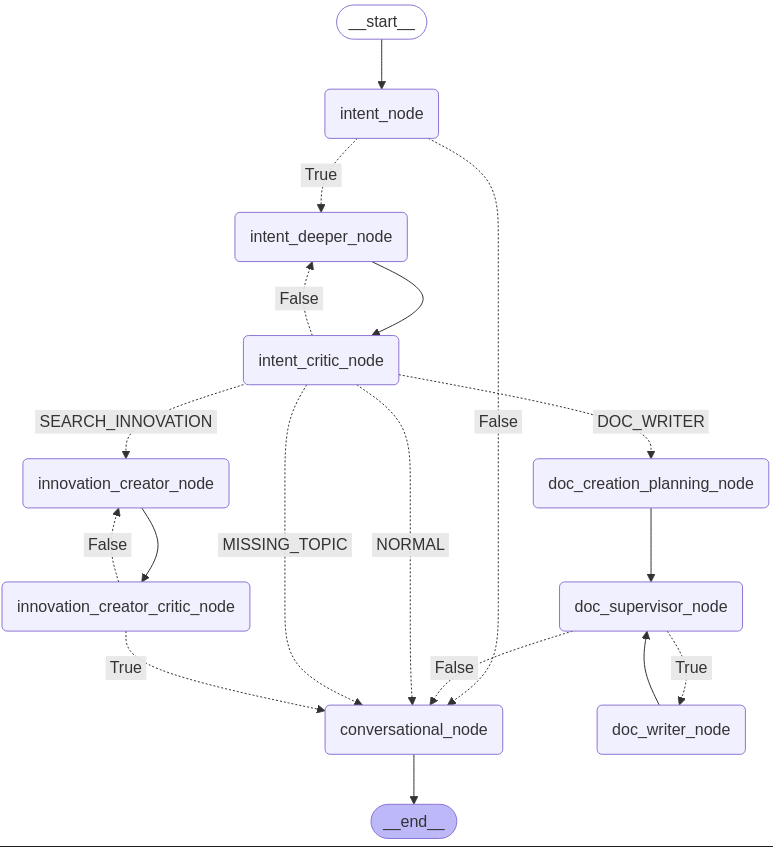

# GenAI - Intelligent Document Writer

## Overview

An AI-driven assistant that guides users through creating large documents. Users provide topics, and the system retrieves relevant information, suggests innovative ideas, plans the document structure, generates content for each section, critiques the results against the plan, and exports the final document as a P

## Features

### 1. Conversational Capabilities

The assistant can handle general conversational inputs such as:

"Hello!"

"How are you?"

"Tell me a joke."

Provides a smooth and natural conversational experience while informing that it is designed to guide the user though a document creation.

### 2. Structured Document Generation

The assistant can generate large research-style innovative documents, generating content for each section while critique the results against the plan in order to refine the created section.

Here you have an example of the intectiong and the Tasks tracking system:

Here you have an example of the planning phase results:

<strong>
{
  "doc_title": "Investigating the Role of Social Media in Spreading Mental Health Stigma during COVID-19",
  "doc_objective": "To explore how social media platforms are used to spread mental health stigma and how AI can be used to track and mitigate the spread of negative online content, ultimately contributing to a better understanding of mental health stigma in the digital age.",
  "sections": [
    {
      "title": "Introduction",
      "section_objective": "To introduce the topic of mental health stigma on social media during COVID-19 and outline the objectives of the dissertation.",
      "subsections": {
        "Background and Context": "To provide an overview of the current state of mental health stigma on social media, including its impact on individuals and society.",
        "Research Questions and Objectives": "To articulate the research questions and objectives, which include investigating how social media platforms are used to spread mental health stigma and developing a method for tracking and mitigating negative online content."
      }
    },
    {
      "title": "Literature Review",
      "section_objective": "To review existing literature on mental health stigma on social media during COVID-19, including the impact of social media on mental health and the role of AI in monitoring and addressing online hate speech.",
      "subsections": {
        "Mental Health Stigma on Social Media": "To examine the current state of research on mental health stigma on social media, including the role of social media in perpetuating stigma and the impact on individuals.",
        "AI and Mental Health Stigma": "To review the literature on AI-powered solutions for monitoring and addressing online hate speech and stigma on social media."
      }
    },
    {
      "title": "Methodology",
      "section_objective": "To outline the research design, methods, and procedures used to collect and analyze data on mental health stigma on social media during COVID-19.",
      "subsections": {
        "Research Design": "To describe the research design, including the type of study, sampling strategy, and data collection methods.",
        "Data Analysis": "To outline the procedures for analyzing data, including qualitative and quantitative methods."
      }
    },
    {
      "title": "Results",
      "section_objective": "To present the findings on mental health stigma on social media during COVID-19, including the impact of social media on individuals and society.",
      "subsections": {
        "Findings on Mental Health Stigma": "To present the quantitative and qualitative findings on the spread of mental health stigma on social media during COVID-19.",
        "Impact of Social Media on Individuals and Society": "To discuss the implications of the findings for individuals and society, including the role of AI in mitigating negative online content."
      }
    },
    {
      "title": "Discussion",
      "section_objective": "To interpret the results, discuss their implications, and compare them to existing literature.",
      "subsections": {
        "Implications of Findings": "To discuss the implications of the findings for mental health stigma on social media during COVID-19.",
        "Comparing with Existing Literature": "To compare the findings with existing research on mental health stigma on social media, including the role of AI in monitoring and addressing online hate speech."
      }
    },
    {
      "title": "Conclusion",
      "section_objective": "To summarize the main findings and contributions of the dissertation.",
      "subsections": {
        "Summary of Findings": "To provide a concise summary of the key findings on mental health stigma on social media during COVID-19.",
        "Future Research Directions": "To outline potential future research directions for investigating mental health stigma on social media, including the role of AI in mitigating negative online content."
      }
    },
    {
      "title": "References",
      "section_objective": "To provide a comprehensive list of sources cited in the dissertation.",
      "subsections": {}
    },
    {
      "title": "Appendices",
      "section_objective": "To include supplementary materials that support the research, such as extra figures, tables, or raw data.",
      "subsections": {}
    }
  ]
}
</strong> 

#### Multi-Agent Implementation Approaches

The multi-agent system delegates different sections of the document to specialized agents, while a supervisor is used to coordinate the multiple agents tasks (Fig. 1).

Fig. 2 - Multi-Agents Diagram  

The multi-agent system is implemented using langgraph, along with ollama and some models supporting tools and structured output.
**The models used were not always following the prompt's instructions and tools usage. For these reason, several parts that would be easily implemented using tools were (at this stage) implemented with some structured outputs and extra logics. In the future, the code will be updated to make the right use of the tools .**

1. LangGraph with Ollama (Llama 3.2)

Leverages LangGraph to create a structured workflow for multi-agent interactions, implementing a Supervisor-Worker model.

Uses Ollama and Llama 3.2 as the underlying language model.

Ensures seamless communication between the agents handling different sections, while the supervisor coordinates the workflow.

2. Custom Multi-Agent Implementation

Implements a Supervisor-Worker model using Ollama (MFDoom/deepseek-r1-tool-calling:1.5b), with the Supervisor coordinating the workflow and deciding which worker agent to work next.

**Three Worker Agents handle specific sections:**

- Agent 1 : Title, Introduction, and Abstract

- Agent 2 : Body of the document

- Agent 3 : Conclusion and References

Provides greater flexibility and control over agent interactions, and increase the tokens limits while generating the document.

## Technology Stack

- Ollama (Llama 3.2 and MFDoom/deepseek-r1-tool-calling:1.5b)

- LangGraph – Graph-based framework for managing multi-agent workflows.

- RAG (Retrieval-Augmented Generation) – For answering scientific queries.

- Python 3

- Chainlit

-  PostgreSQL + pgvector 

# Install dependencies
pip install -r Virtual_Assistant/chainlit_app/requirements.txt

# Run the assistant
chainlit run app.py -w